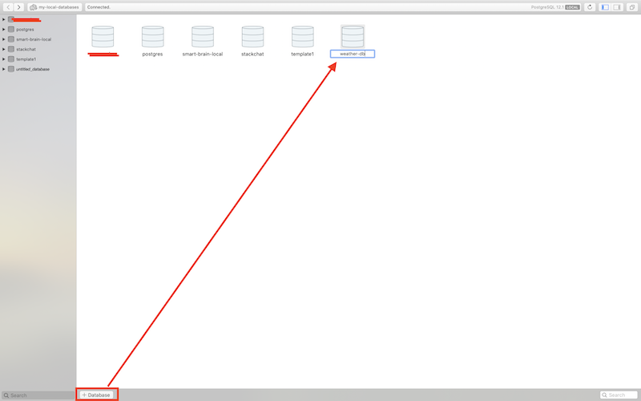
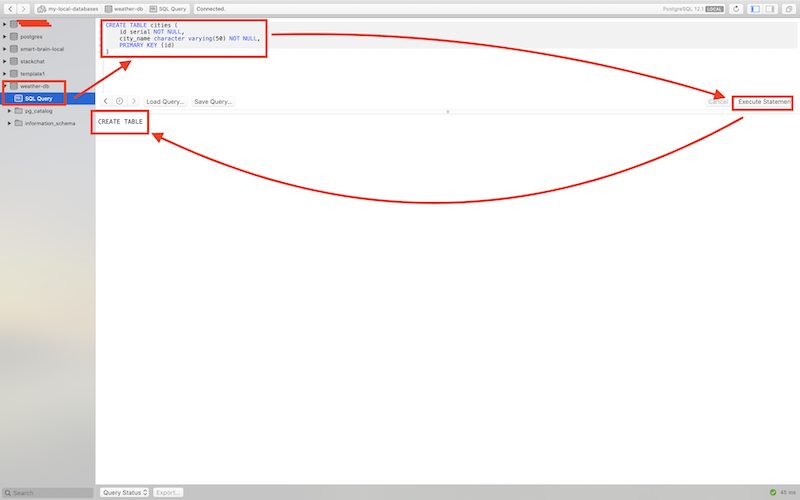

------------------------------------------------------------
# Full Stack React App Tutorial
A simple weather app, built for my full stack React app tutorial. Also features Reactstrap, Express, and PostgreSQL.

This tutorial is from [Develop and Deploy a Full Stack React App](https://brycestpierre.com/full-stack-react-app/), by By Bryce St. Pierre. Thanks for his hard work and help! 

#### Instruction.

1. Run commands in terminal
```bash
$ git clone <github-link>
$ cd <folder-name>
$ npm i
$ npm run installAll
```

2. Sign up and get your own Weather api key in [https://openweathermap.org/](https://openweathermap.org/),

3. Create a new file call '.env'.

__`Location:./server/.env`__
```js
WEATHER_API=dd9999999999999999999999 // <-- replace with your api key
```

4. Create a local database in Postgres.(Here we use Postico GUI.)

<p align="center">

</p>

------------------------------------------------------------

5. Create a table.

<p align="center">

</p>

```sql
CREATE TABLE cities (
	id serial NOT NULL,
	city_name character varying(50) NOT NULL,
	PRIMARY KEY (id)
)
```
------------------------------------------------------------


5. Run the app in local.
```bash
$ npm run dev
```
------------------------------------------------------------

# Web development tools (Part 29)

- #### Click here: [BACK TO NAVIGASTION](https://github.com/DonghaoWu/WebDev-tools-demo/blob/master/README.md)

## `Section: Deploy.` (Basic)

### `Summary`: In this documentation, we learn to deploy a fullstack application with tech stack React, Node, Express and Postgres.

### `Check Dependencies & Tools:`

`Backend:`
- body-parser
- cookie-parser
- dotenv
- express
- pg :star:(8.3.0)
- request
- request-promise

`Frontend:`
- bootstrap
- lodash
- lodash.template
- merge
- react
- react-dom
- react-scripts
- reactstrap

------------------------------------------------------------

#### `本章背景：`
- 本章是一个很简单的部署圈占应用程序的教程，使用的技术栈包括：React，Node，Express，Postgres，部署平台是 Heroku。

- 本实例有三个特点，第一个是全栈部署，第二是使用 Postgres 部署，有比较大的实用指导意义，第三时作者对于 SQL database 的设置比较原生，也是一个很好学习的机会。

- 自己对原本的文件结构进行调整，对应的 package.json 也进行了修改，是一个很好的学习机会。[heroku customize nodejs scripts](https://devcenter.heroku.com/articles/nodejs-support)

------------------------------------------------------------
- 设计思路：

1. 后端思路：

2. 前端思路：

3. 可以补充的工作：
    - 加入 redis。
    - 增加前端错误信息显示条，比如说前端和后端都遇到错误，前端进行页面跳转并显示来自后端的错误信息。
    - 提升 code 的逻辑，减少重复。
    - 增加 errorHandler。
------------------------------------------------------------

### <span id="29.0">`Brief Contents & codes position`</span>

- #### Click here: [BACK TO NAVIGASTION](https://github.com/DonghaoWu/WebDev-tools-demo/blob/master/README.md)

- [29.1 Change file structure.](#29.1)
- [29.2 Work on back end signin route.](#29.2)
- [29.3 Store token and load user automatically in Front end.](#29.3)
- [29.4 Middleware.](#29.4)
- [29.5 Others.](#29.5)

------------------------------------------------------------

### <span id="29.1">`Step1: Change file structure.`</span>

- #### Click here: [BACK TO CONTENT](#29.0)

1. 传统的 fullstack 文件结构（网上常见的 heroku deploy 教程结构），[查看这里：Weather-RNEP-heroku-old](https://github.com/DonghaoWu/Weather-RNEP-heroku-old)

  - 之前的结构是把前端 app 放在大文件夹里面，前端 app 有自己的 package.json，但是后端 app 不是独立的，它跟全局共用一个 package.json，所以之前一共有两个 package.json，分别是：

  __`Location:./package.json`__

  ```json
  {
    "name": "postgres-deploy-heroku",
    "version": "1.0.0",
    "description": "A tutorial about deploy a postgres fullstack application.",
    "main": "index.js",
    "scripts": {
      "dev": "concurrently \"npm run server\" \"npm run client\"",
      "client": "npm start --prefix client",
      "server": "nodemon server",
      "start": "node server",
      "heroku-postbuild": "cd client && npm install && npm run build"
    },
    "repository": {
      "type": "git",
      "url": "git+https://github.com/DonghaoWu/deploy-example-heroku.git"
    },
    "keywords": [
      "postgres-deploy-heroku"
    ],
    "author": "Donghao",
    "license": "ISC",
    "bugs": {
      "url": "https://github.com/DonghaoWu/deploy-example-heroku/issues"
    },
    "homepage": "https://github.com/DonghaoWu/deploy-example-heroku#readme",
    "devDependencies": {
      "concurrently": "^5.2.0",
      "nodemon": "^2.0.4"
    },
    "dependencies": {
      "body-parser": "^1.19.0",
      "cookie-parser": "^1.4.5",
      "dotenv": "^8.2.0",
      "express": "^4.17.1",
      "pg": "^8.3.0",
      "request": "^2.88.2",
      "request-promise": "^4.2.6"
    }
  }
  ```

  __`Location:./client/package.json`__

  ```json
    
  {
    "name": "client",
    "version": "0.1.0",
    "private": true,
    "dependencies": {
      "bootstrap": "^4.3.1",
      "lodash": "^4.17.19",
      "lodash.template": "^4.5.0",
      "merge": "^1.2.1",
      "react": "^16.5.1",
      "react-dom": "^16.5.1",
      "react-scripts": "^3.4.1",
      "reactstrap": "^6.4.0"
    },
    "scripts": {
      "start": "react-scripts start",
      "build": "react-scripts build",
      "test": "react-scripts test --env=jsdom",
      "eject": "react-scripts eject"
    },
    "proxy": "http://localhost:5000",
    "browserslist": {
      "production": [
        ">0.2%",
        "not dead",
        "not op_mini all"
      ],
      "development": [
        "last 1 chrome version",
        "last 1 firefox version",
        "last 1 safari version"
      ]
    }
  }
  ```

2. 修改后，把后端 app 独立起来，使后端 app 有自己的 package.json，这需要把一些 dependency 转移到 server 文件夹中，同时对根目录的 package.json 进行修改。

```diff
+ ./client/package.json 不用修改
```

__`Location:./package.json`__

```diff
{
  "name": "postgres-deploy-heroku",
  "version": "1.0.0",
  "description": "A tutorial about deploy a postgres fullstack application.",
  "main": "index.js",
  "scripts": {
+   "installAll": "concurrently \"npm run installServer\" \"npm run installClient\"",
+   "installServer": "cd server && npm install",
+   "installClient": "cd client && npm install",
+   "dev": "concurrently \"npm run server\" \"npm run client\"",
+   "client": "npm start --prefix client",
+   "server": "npm run server --prefix server",
+   "start": "npm start --prefix server",
+   "heroku-prebuild": "cd server && npm install",
+   "heroku-postbuild": "cd client && npm install && npm run build"
  },
  "repository": {
    "type": "git",
    "url": "git+https://github.com/DonghaoWu/deploy-example-heroku.git"
  },
  "keywords": [
    "postgres-deploy-heroku"
  ],
  "author": "Donghao",
  "license": "ISC",
  "bugs": {
    "url": "https://github.com/DonghaoWu/deploy-example-heroku/issues"
  },
  "homepage": "https://github.com/DonghaoWu/deploy-example-heroku#readme",
  "devDependencies": {
+   "concurrently": "^5.2.0"
  }
}
```

__`Location:./server/package.json`__

```diff
{
  "name": "server",
  "version": "1.0.0",
  "description": "",
  "main": "index.js",
  "scripts": {
    "server": "nodemon index.js",
    "start": "node index.js"
  },
  "author": "",
  "license": "ISC",
  "dependencies": {
+   "body-parser": "^1.19.0",
+   "cookie-parser": "^1.4.5",
+   "dotenv": "^8.2.0",
+   "express": "^4.17.1",
+   "pg": "^8.3.0",
+   "request": "^2.88.2",
+   "request-promise": "^4.2.6"
  },
  "devDependencies": {
+   "nodemon": "^2.0.4"
  }
}
```
#### `Comment:`
1. 修改文件结构确实使工作量增多了，但这样做能够最大程度保持前端 app 和后端 app 能独立一个文件夹，使用起来会清楚很多。

### <span id="29.2">`Step2: Work on back end signin route.`</span>

- #### Click here: [BACK TO CONTENT](#29.0)

1.  Change the function name

    __`Location:./demo-apps/backend-smart-brain-api-Auth/server.js`__


```diff
- app.post('/signin', (req, res) => { signin.handleSignin(req, res, db, bcrypt) })

+ app.post('/signin', (req, res) => { signin.signinAuthentication(req, res, db, bcrypt) })
```

2. Add the new function.

    __`Location:./demo-apps/backend-smart-brain-api-Auth/controllers/signin.js`__

```js
const signinAuthentication = (req, res, db, bcrypt) => {
  const { authorization } = req.headers;
  return authorization ? hasTokenAndGetIdFromRedis(req, res)
    : noTokenSigninAndGetUser(req, res, db, bcrypt)
      .then(data => {
        return data.id && data.email ? createSession(data) : Promise.reject(data)
      })
      .then(session => {
        return res.json(session);
      })
      .catch(err => {
        return res.status(400).json(err)
      });
}
```

3. Add function hasTokenAndGetIdFromRedis. （有 token 的时候就用 token 在 redis 中取得 id。）

    __`Location:./demo-apps/backend-smart-brain-api-Auth/controllers/signin.js`__

```js
const hasTokenAndGetIdFromRedis = (req, res) => {
  const { authorization } = req.headers;
  return redisClient.get(authorization, (err, reply) => {
    if (err || !reply) {
      return res.status(400).json('Unauthorized.');
    }
    return res.json({ id: reply })
  })
}
```

4. Promise the handleSignin function, and change the name to noTokenSigninAndGetUser.（无 token 的时候先验证 email 和 password， 然后在 postgres database 中获得 email 和 id。）

    __`Location:./demo-apps/backend-smart-brain-api-Auth/controllers/signin.js`__

```diff

-const handleSignin = (db, bcrypt) => (req, res) => {
-  const { email, password } = req.body;
-  if (!email || !password) {
-    return res.status(400).json('incorrect form submission');
-  }
-  db.select('email', 'hash').from('login')
-    .where('email', '=', email)
-    .then(data => {
-      const isValid = bcrypt.compareSync(password, data[0].hash);
-      if (isValid) {
-        return db.select('*').from('users')
-          .where('email', '=', email)
-          .then(user => {
-            res.json(user[0])
-          })
-          .catch(err => res.status(400).json('unable to get user'))
-      } else {
-        res.status(400).json('wrong credentials')
-      }
-    })
-    .catch(err => res.status(400).json('wrong credentials'))
-}


+const noTokenSigninAndGetUser = (req, res, db, bcrypt) => {
+  const { email, password } = req.body;
+  if (!email || !password) {
+    return Promise.reject('incorrect form submission');
+  }
+  return db.select('email', 'hash').from('login')
+    .where('email', '=', email)
+    .then(data => {
+      const isValid = bcrypt.compareSync(password, data[0].hash);
+      if (isValid) {
+        return db.select('*').from('users')
+          .where('email', '=', email)
+          .then(user => {
+            return Promise.resolve(user[0]);
+          })
+          .catch(err => Promise.reject('unable to get user'))
+      } else {
+        return Promise.reject('wrong credentials (wrong password)')
+      }
+    })
+    .catch(err => Promise.reject('wrong credentials (wrong email)'))
+}
```

5. Create session.（接上，获得 id 和 email 之后以 email 作为参数生成 token，然后储存在 redis 中，最后返回一个包含 id 和 token 等信息的 session data）。

    __`Location:./demo-apps/backend-smart-brain-api-Auth/controllers/signin.js`__

```js
const signToken = (email) => {
  const jwtPayload = { email };
  return jwt.sign(jwtPayload, process.env.JWT_SECRET, { expiresIn: '2 days' });
}

const setToken = (token, id) => {
  return Promise.resolve(redisClient.set(token, id))
}

const createSession = (user) => {
  const { email, id } = user;
  const token = signToken(email);
  return setToken(token, id)
    .then(() => {
      return {
        success: 'true',
        userId: id,
        token: token
      }
    })
    .catch(err => {
      return Promise.reject(`creact session failed.`)
    })
}
```
------------------------------------------------------------

#### `Comment:`
1. 无论是有没有 token，经过 signin route 之后，所有成功的话都可以返回一个包含 user id 信息的 data。
2. :star::star:至于为什么没有 token 的情况除了返回 id 之外还返回 token，因为前端成功 signin 之后需要拿 token 放在 window.localStorage 中作为缓存。

3. 完整文件：

```js
const jwt = require('jsonwebtoken');
const redis = require('redis');

// setup Redis:
const redisClient = redis.createClient(process.env.REDIS_URI);

const noTokenSigninAndGetUser = (req, res, db, bcrypt) => {
  const { email, password } = req.body;
  if (!email || !password) {
    return Promise.reject('incorrect form submission');
  }
  return db.select('email', 'hash').from('login')
    .where('email', '=', email)
    .then(data => {
      const isValid = bcrypt.compareSync(password, data[0].hash);
      if (isValid) {
        return db.select('*').from('users')
          .where('email', '=', email)
          .then(user => {
            return Promise.resolve(user[0]);
          })
          .catch(err => Promise.reject('unable to get user'))
      } else {
        return Promise.reject('wrong credentials (wrong password)')
      }
    })
    .catch(err => Promise.reject('wrong credentials (wrong email)'))
}

const hasTokenAndGetIdFromRedis = (req, res) => {
  const { authorization } = req.headers;
  return redisClient.get(authorization, (err, reply) => {
    if (err || !reply) {
      return res.status(400).json('Unauthorized.');
    }
    return res.json({ id: reply })
  })
}

const signToken = (email) => {
  const jwtPayload = { email };
  return jwt.sign(jwtPayload, process.env.JWT_SECRET, { expiresIn: '2 days' });
}

const setToken = (token, id) => {
  return Promise.resolve(redisClient.set(token, id))
}

const createSession = (user) => {
  const { email, id } = user;
  const token = signToken(email);
  return setToken(token, id)
    .then(() => {
      return {
        success: 'true',
        userId: id,
        token: token
      }
    })
    .catch(err => {
      return Promise.reject(`creact session failed.`)
    })
}

const signinAuthentication = (req, res, db, bcrypt) => {
  const { authorization } = req.headers;
  return authorization ? hasTokenAndGetIdFromRedis(req, res)
    : noTokenSigninAndGetUser(req, res, db, bcrypt)
      .then(data => {
        return data.id && data.email ? createSession(data) : Promise.reject(data)
      })
      .then(session => {
        return res.json(session);
      })
      .catch(err => {
        return res.status(400).json(err)
      });
}

module.exports = {
  signinAuthentication: signinAuthentication
}
```

### <span id="29.3">`Step3: Store token and load user automatically in Front end.`</span>

- #### Click here: [BACK TO CONTENT](#29.0)

1. Handle no token (Signin.js).

    __`Location:./demo-apps/frontend-smart-brain-Auth/src/components/Signin/Signin.js`__


```js
  saveAuthTokenInSession = (token) => {
    window.localStorage.setItem('token', token);
  }

  onSubmitSignIn = () => {
    fetch('http://localhost:4000/signin', {
      method: 'post',
      headers: { 'Content-Type': 'application/json' },
      body: JSON.stringify({
        email: this.state.signInEmail,
        password: this.state.signInPassword
      })
    })
      .then(response => response.json())
      .then(session => {
        if (session.userId && session.success === 'true') {
          this.saveAuthTokenInSession(session.token);
          fetch(`http://localhost:4000/profile/${session.userId}`, {
            method: 'get',
            headers: {
              'Content-type': 'application/json',
              'Authorization': session.token
            }
          })
            .then(res => res.json())
            .then(user => {
              if (user && user.email) {
                this.props.loadUser(user);
                this.props.onRouteChange('home');
              }
            })
            .catch(err => {
              console.log(err);
            })
        }
      })
      .catch(err => {
        console.log(err);
      })
  }
```

2. Handle token (App.js).

    __`Location:./demo-apps/frontend-smart-brain-Auth/src/App.js`__

```js
  componentDidMount() {
    const token = window.localStorage.getItem('token');
    if (token) {
      fetch('http://localhost:4000/signin', {
        method: 'post',
        headers: {
          'Content-type': 'application/json',
          'Authorization': token
        }
      })
        .then(res => res.json())
        .then(data => {
          if (data && data.id) {
            fetch(`http://localhost:4000/profile/${data.id}`, {
              method: 'get',
              headers: {
                'Content-type': 'application/json',
                'Authorization': token
              }
            })
              .then(res => res.json())
              .then(user => {
                if (user && user.email) {
                  this.loadUser(user);
                  this.onRouteChange('home');
                }
              })
          }
        })
        .catch(err => {
          console.log('failed');
        })
    }
  }
```

#### `Comment:`
1. 这就是 react 前端处理 authentication 的常用操作，当然一条 route 分两个 componet 公用的方法可以改善。
2. :star::star::star:但上面用到的 componentDidMount 和 window.localStorage 的思路都是 authentication 里面必须的。

### <span id="29.4">`Step4: Middleware.`</span>

- #### Click here: [BACK TO CONTENT](#29.0)

1. Create a middleware.

    __`Location:./demo-apps/backend-smart-brain-api-Auth/middlewares/authorization.js`__

```js
const redis = require('redis');
const redisClient = redis.createClient(process.env.REDIS_URI);

const requireAuth = (req, res, next) => {
    const { authorization } = req.headers;
    if (!authorization) {
        return res.status(401).json('Unauthorized')
    }
    return redisClient.get(authorization, (err, reply) => {
        if (err || !reply) {
            return res.status(401).json('Unauthorized');
        }
        console.log('pass middleware');
        return next();
    })
}

module.exports = {
    requireAuth,
}
```

2. Add middleware to routes.

    __`Location:./demo-apps/backend-smart-brain-api-Auth/server.js`__

```diff
require('dotenv').config();
const express = require('express');
const bodyParser = require('body-parser');
const bcrypt = require('bcrypt-nodejs');
const cors = require('cors');
const knex = require('knex');
const morgan = require('morgan');

const register = require('./controllers/register');
const signin = require('./controllers/signin');
const profile = require('./controllers/profile');
const image = require('./controllers/image');
+ const auth = require('./middlewares/authorization');

const db = knex({
  client: process.env.POSTGRES_CLIENT,
  connection: {
    host: process.env.POSTGRES_HOST,
    user: process.env.POSTGRES_USER,
    password: process.env.POSTGRES_PASSWORD,
    database: process.env.POSTGRES_DB
  }
});

const app = express();

app.use(morgan('tiny'));
app.use(cors());
app.use(bodyParser.json());

app.get('/', (req, res) => { res.send(`This message is from server.js. You will get this message when visit http://localhost:4000/`) })
app.post('/signin', (req, res) => { signin.signinAuthentication(req, res, db, bcrypt) })
app.post('/register', (req, res) => { register.registerAuthentication(req, res, db, bcrypt) })
+ app.get('/profile/:id', auth.requireAuth, (req, res) => { profile.handleProfileGet(req, res, db) })
+ app.post('/profile/:id', auth.requireAuth, (req, res) => { profile.handleProfileUpdate(req, res, db) });
+ app.put('/image', auth.requireAuth, (req, res) => { image.handleImage(req, res, db) })
+ app.post('/imageurl', auth.requireAuth, (req, res) => { image.handleApiCall(req, res) })

app.listen(4000, () => {
  console.log('app is running on port 4000');
})
```

3. Add header in Front end api call.

    __`Location:./demo-apps/frontend-smart-brain-Auth/src/App.js`__

```diff
  onButtonSubmit = () => {
+   const token = window.localStorage.getItem('token');
+   if (!token) {
+     this.setState(initialState);
+     window.localStorage.removeItem('token');
+     return;
+   }
    this.setState({ imageUrl: this.state.input });
    fetch('http://localhost:4000/imageurl', {
      method: 'post',
      headers: {
        'Content-type': 'application/json',
+       'Authorization': token,
      },
      body: JSON.stringify({
        input: this.state.input
      })
    }).then(response => response.json())
      .then(response => {
        if (response) {
          fetch('http://localhost:4000/image', {
            method: 'put',
            headers: {
              'Content-type': 'application/json',
+             'Authorization': token,
            },
            body: JSON.stringify({
              id: this.state.user.id
            })
          })
            .then(response => response.json())
            .then(count => {
              this.setState(Object.assign(this.state.user, { entries: count }))
            })
            .catch(console.log)

        }
        this.displayFaceBox(this.calculateFaceLocations(response))
      })
      .catch(err => console.log(err));
  }
```


__`Location:./demo-apps/frontend-smart-brain-Auth/src/components/Profile/Profile.js`__

```diff
    onProfileUpdate = (data) => {
+       const token = window.localStorage.getItem('token');
+       if (!token) {
+           this.props.loadUser(this.props.initialState);
+           window.localStorage.removeItem('token');
+           this.props.onRouteChange('signin');
+           this.props.toggleModal();
+           return;
+       }
        fetch(`http://localhost:4000/profile/${this.props.user.id}`, {
            method: 'post',
            headers: {
                'Content-type': 'application/json',
+               'Authorization': token,
            },
            body: JSON.stringify({
                formInput: data
            })
        }).then(resp => {
            if (resp.status === 200 || resp.status === 304) {
                this.props.toggleModal();
                this.props.loadUser({ ...this.props.user, ...data });
            }
        }).catch(console.log)
    }
```

#### `Comment:`
1. 这个 middleware 的作用是从 req.headers 中提取 token，然后查询 redis，如果没有结果就停止进程 return，如果有就不用传输数据，直接进入 route 的下一步。

2. :star::star:这个 middleware 可以加上一个 errorHandler 在 server.js 的，后面增加。

3. 上面的前端代码增加了处理 token 无效或者手动删除 session 的情况。

### <span id="29.5">`Step5: Others.`</span>

- #### Click here: [BACK TO CONTENT](#29.0)

1. 在 docker 中使用 redis cli：
```bash
$ docker-compose exec redis redis-cli
```

2. 查看正在运行的 redis 端口：

```bash
$ ps aux | grep redis
```

#### `Comment:`
1. 

------------------------------------------------------------

__`本章用到的全部资料：`__

1. [Bearer token I](https://security.stackexchange.com/questions/108662/why-is-bearer-required-before-the-token-in-authorization-header-in-a-http-re)

2. [Bearer token II](https://auth0.com/blog/refresh-tokens-what-are-they-and-when-to-use-them/)


- #### Click here: [BACK TO CONTENT](#29.0)
- #### Click here: [BACK TO NAVIGASTION](https://github.com/DonghaoWu/WebDev-tools-demo/blob/master/README.md)